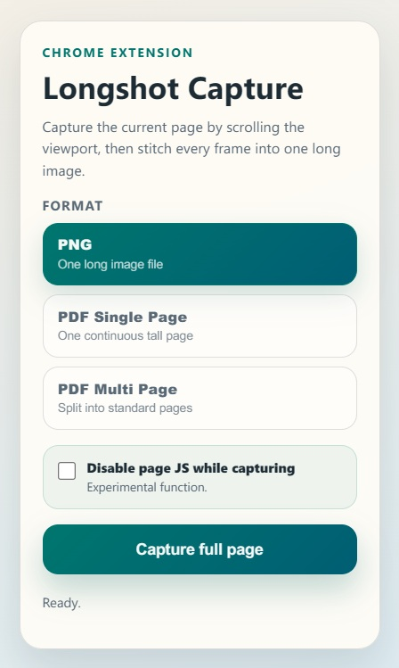

# Longshot Capture

This folder contains a Chrome extension that can:

- capture a page by scrolling through the viewport
- stitch all captured frames into one long PNG image
- export PDF in single-page or multi-page mode
- optionally disable page JavaScript during capture for unstable scrolling pages

## UI Preview

## Load the extension

1. Open `chrome://extensions` in Chrome.
2. Turn on **Developer mode**.
3. Click **Load unpacked**.
4. Select this folder.

## Use it

1. Open the page you want to capture.
2. Click the extension icon.
3. Click **Capture full page**.
4. Wait for the stitched image to download.

## Notes

- Restricted pages such as `chrome://` pages cannot be captured.
- Very large pages (e.g. 200+ pages) are stitched into a single PNG using streaming compression to bypass the browser canvas height limit.
- Sticky headers and floating elements are captured exactly as they appear while scrolling.